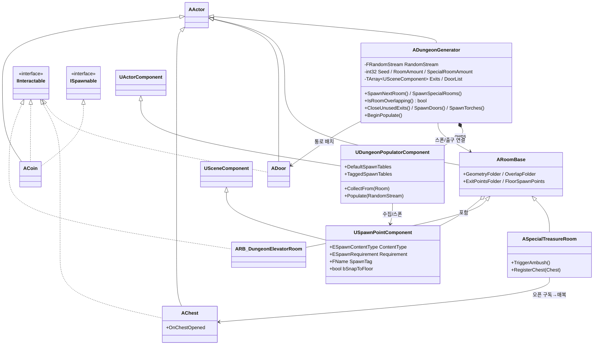
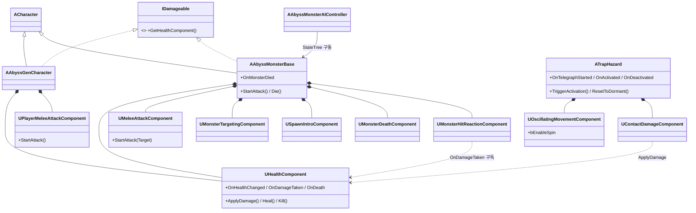

# AbyssGen

언리얼 엔진 5 기반 절차적 던전 생성(Procedural Dungeon Generation) 게임 프로젝트. 시드 기반으로 모듈형 방(Room)을 출구 단위로 이어 붙여 던전을 만들고, 그 위에 전투(플레이어/몬스터), 함정, 상호작용 오브젝트, 확률 기반 콘텐츠 스폰을 얹는다.

- **엔진**: Unreal Engine 5
- **언어**: C++(런타임 모듈 `AbyssGen`) + 블루프린트(콘텐츠·연출)
- **플러그인**: StateTree, GameplayStateTree
- **모듈 의존성**: Core, CoreUObject, Engine, InputCore, EnhancedInput, AIModule, NavigationSystem, Niagara, StateTreeModule, GameplayStateTreeModule, UMG, Slate

## 설계 원칙

이 프로젝트의 C++는 **합성(composition) 우선 + 단일 책임(SRP)** 을 따른다.

- **god-class를 `UActorComponent`로 분해한다.** 소유 액터(몬스터·캐릭터·함정)는 컴포넌트를 조립·중계하는 **얇은 façade**가 되고, 실제 동작(체력·공격·사망·피격·이동)은 각 컴포넌트가 책임진다.
- **데미지는 엔진 표준 경로를 쓴다.** `UGameplayStatics::ApplyDamage → AActor::TakeDamage → OnTakeAnyDamage`. `UHealthComponent`가 소유 액터의 `OnTakeAnyDamage`에 스스로 연결되므로, 액터는 `TakeDamage`를 오버라이드하지 않는다. 체력 조회는 `IDamageable` 인터페이스로 다형화한다.
- **던전 생성과 콘텐츠 배치를 분리한다.** `ADungeonGenerator`는 방 레이아웃(토폴로지)만 만들고, 콘텐츠 스폰은 `UDungeonPopulatorComponent`에 위임한다.
- **위치와 대상을 분리한다.** "어디에 스폰할지"는 방 BP에 놓인 `USpawnPointComponent` 마커가, "무엇을 스폰할지"는 생성기 쪽 스폰 테이블이 정한다.

## 소스 구조

```
Source/AbyssGen/
├─ PDG/          던전 생성·방·스폰·상호작용 오브젝트
├─ Combat/       체력·데미지·공격(플레이어/공용)
├─ Monster/      컴포넌트 기반 몬스터 + StateTree AI
├─ Trap/         동적 함정(왕복/회전 + 접촉 피해)
├─ Interactable.h / Spawnable.h   공용 인터페이스
└─ AbyssGenCharacter.*            플레이어 캐릭터
```

> 저장소의 `Variant_Combat/`, `Variant_Platforming/`, `Variant_SideScrolling/` 는 언리얼 기본 템플릿 파생 샘플이며 본 시스템과 무관하다.

---

## 1. 던전 생성 (PDG)

### 생성 방식

생성기(`ADungeonGenerator`)는 미리 만든 방 블루프린트를 출구(Exit) 트랜스폼에 스냅해 붙이는 방식으로 던전을 구성한다. 그리드/타일맵을 쓰지 않으며 배치는 전적으로 각 방의 출구 월드 트랜스폼으로 결정된다.

- 모든 무작위 분기(방 선택, 출구 선택, 스폰 확률)는 단일 `FRandomStream`을 통과한다 → **같은 시드는 같은 던전**.
- `Seed == -1`이면 `FMath::Rand()`로 시드를 생성해 화면에 출력한다.
- `RoomAmount`로 목표 방 개수를 지정한다. 겹침으로 폐기된 방은 카운트를 복구해 목표 개수를 유지한다.
- `SpecialRoomAmount`개의 특수방을 일반 방 배치 후 남은 막다른 출구에 배치한다.

### 실행 흐름

```
ADungeonGenerator::BeginPlay
  ├─ SetSeed()            시드 초기화(-1이면 난수)
  ├─ SpawnStarterRoom()   StarterRoom 배치, 출구 수집, Populator에 스폰포인트 수집
  ├─ SpawnNextRoom()      재귀: 출구 1개 선택 → 방 스폰 → 겹침 검사 → RoomAmount까지 반복
  ├─ SpawnSpecialRooms()  남은 출구에 특수방 SpecialRoomAmount개 배치
  │
  └─ (다음 틱) FinalizeDungeon       ← 방 배치 후 콜리전 오버랩이 갱신되길 기다림
        ├─ CloseUnusedExits()   남은 출구를 ClosingWall로 차단
        ├─ SpawnDoors()         DoorList(연결된 출구)에 Door 배치
        ├─ SpawnTorches()       DoorList의 출구 방향에만 토치 배치
        └─ BeginPopulate()      PopulatorComponent.Populate(RandomStream) 위임
```

- **겹침 검사 `IsRoomOverlapping`** 는 부수효과가 없다. 새 방의 `OverlapFolder` 하위 `UBoxComponent`마다 `GetOverlappingComponents`를 호출해 다른 액터와 겹치면 `true`를 반환한다. 호출자(`SpawnNextRoom`)가 겹친 방을 `Destroy()`하고 카운트를 복구해 재시도한다.
- **마감 단계 지연**: 출구 차단·문·토치·콘텐츠 스폰은 방 배치 직후의 물리 오버랩 갱신 전에 실행하면 안 되므로, `SetTimerForNextTick`으로 다음 틱에 단일 콜백으로 실행한다.

### 방 구조 — `ARoomBase`

모든 방은 `ARoomBase`를 상속한다. 내부는 역할별 `USceneComponent` 폴더로 나뉘고, 생성기는 폴더의 자식 컴포넌트를 수집하는 방식으로만 방을 다룬다(방 내부 구성에 비의존).

| 폴더 | 역할 |
| --- | --- |
| `GeometryFolder` | 보이는 지오메트리(바닥·벽·천장; 방 BP에서 ISM으로 구성) |
| `OverlapFolder` | 겹침 검사용 `UBoxComponent` |
| `ExitPointsFolder` | 출구 포인트(Arrow). 그 하위에 문/토치용 마커 배치 |
| `FloorSpawnPoints` | `USpawnPointComponent` 마커 묶음 |

파생 방:

- **`ASpecialTreasureRoom`** — 보물방. `AChest`의 `OnChestOpened`를 구독해, 상자를 열면 `Enemy.Ambush` 태그 스폰포인트에 매복 몬스터를 디졸브 연출과 함께 스폰한다.
- **`ARB_DungeonElevatorRoom`**(`IInteractable`) — 캐릭터 오버랩 시 `ToggleElevator()`로 엘리베이터를 상하 이동(`MoveSpeed = 600cm/s`).

### 콘텐츠 스폰 — `UDungeonPopulatorComponent`

생성기에 부착된 컴포넌트가 콘텐츠 스폰을 전담한다.

```
USpawnPointComponent (방 BP에 배치)
  ├─ ESpawnContentType ContentType  : Enemy / Item / Reward / Prop / Trap / Objective
  ├─ ESpawnRequirement Requirement  : Optional / Guaranteed / Unique / RoomUnique
  ├─ FName  SpawnTag                : 비우면 ContentType 기본 테이블, 지정 시 태그 테이블
  ├─ float  SpawnChance             : 포인트 단위 확률
  ├─ bool   bSnapToFloor            : 바닥 라인트레이스 보정
  └─ bool   bSpawnOnDungeonGeneration : 던전 생성 시 자동 스폰 여부

FSpawnTable
  ├─ TArray<TSubclassOf<AActor>> Classes      : 스폰 후보
  └─ float SpawnChance (0~1)                  : 테이블 단위 확률

UDungeonPopulatorComponent
  ├─ TMap<ESpawnContentType, FSpawnTable> DefaultSpawnTables  : 콘텐츠 타입별 기본 테이블
  └─ TMap<FName, FSpawnTable>             TaggedSpawnTables   : SpawnTag 전용 테이블
```

`Populate()` 동작: 수집한 스폰포인트마다 → `ResolveSpawnTable`(태그 우선, 없으면 ContentType 기본) → `Requirement`에 따른 중복 억제(Unique/RoomUnique) → `ShouldSpawnPoint`(Optional이면 `포인트 × 테이블` 확률 굴림, 그 외 항상) → 후보 중 무작위 1개 → `ResolveGroundedSpawnLocation`(바닥 스냅 + `ISpawnable::GetGroundOffset`)로 위치 보정 후 스폰.

> 바닥 스냅 헬퍼 `USpawnPointComponent::ResolveGroundedSpawnLocation`은 Populator와 `ASpecialTreasureRoom`이 공유한다.

### 던전 오브젝트

| 액터 | 인터페이스 | 동작 |
| --- | --- | --- |
| `ADoor` | `IInteractable` | `FacingArrow` 기준으로 캐릭터의 앞/뒤를 판정해 ±90° Yaw 회전, 이탈 시 원위치 (`RotateSpeed = 4.0`) |
| `AClosingWall` | — | 미사용 출구를 막는 벽 |
| `AChest` | `IInteractable` | `LidPivot`을 Roll 회전(`OpenAngle = -100`), `OnChestOpened` 이벤트 브로드캐스트 |
| `ACoin` | `IInteractable`, `ISpawnable` | 회전·상하 부양 연출, 오버랩 시 `Destroy()`, 바닥에서 `HoverHeight`만큼 띄움 |

---

## 2. 전투 (Combat)

### 체력·데미지 — `UHealthComponent` + `IDamageable`

- `UHealthComponent`가 HP/데미지/사망을 캡슐화한다. `BeginPlay`에서 소유 액터의 `OnTakeAnyDamage`에 자동 연결되어 **엔진 표준 데미지**를 수신한다.
- 이벤트: `OnHealthChanged`, `OnDamageTaken`, `OnDeath`(BlueprintAssignable) — UI·연출·사망 처리가 구독한다.
- API: `ApplyDamage`, `Heal`, `Kill`, `SetMaxHealth`, `GetHealthPercent` 등.
- `IDamageable::GetHealthComponent()` 로 체력 컴포넌트를 다형 조회(AI 타겟 검증 등). 플레이어·몬스터가 모두 구현한다.

### 공격 — 근접 공격 컴포넌트

| 컴포넌트 | 소유자 | 특징 |
| --- | --- | --- |
| `UMeleeAttackComponent` | 몬스터 | `StartAttack(Target)` → 몽타주 재생 → 준비시간 후 전방 스윕 트레이스 → 데미지. LoS 검증, `OnAttackFinished` 통지 |
| `UPlayerMeleeAttackComponent` | 플레이어 | `StartAttack()` → 컨트롤러 Yaw 정렬 후 트레이스. 입력 주도 |

- 타격 판정 시점은 애님 노티파이가 구동한다: `AnimNotify_MeleeAttackTrace`(몬스터) / `AnimNotify_PlayerAttackTrace`(플레이어)가 각 컴포넌트의 `ExecuteAttackTrace()`를 호출한다. 노티파이가 없으면 폴백 타이머로 종료한다.

### 플레이어 — `AAbyssGenCharacter`

`ACharacter` + `IDamageable`. `UHealthComponent`와 `UPlayerMeleeAttackComponent`를 조립한다. 체력 0 시 `OnDeath → HandleDeath`로 입력·이동·콜리전을 끄고 `RestartLevel()`로 현재 레벨을 재시작한다. 오버랩 시 `IInteractable`을 가진 상대에게 `OnInteractorEnter/Exit`를 중계한다.

---

## 3. 몬스터 (Monster)

`AAbyssMonsterBase`(`ACharacter`, `ISpawnable`, `IDamageable`)는 **코디네이터**다. 직접 로직을 갖지 않고 6개 컴포넌트를 조립하며, 외부에는 단일 진입점(façade) 메서드와 `OnMonsterDied`만 노출한다.

| 컴포넌트 | 책임 |
| --- | --- |
| `UHealthComponent` | HP/데미지/사망 (공용) |
| `UMeleeAttackComponent` | 근접 공격 실행 (공용) |
| `UMonsterTargetingComponent` | 플레이어 탐지, 사거리·시야(LoS) 판정, `FaceTarget` |
| `USpawnIntroComponent` | 스폰 연출(이동 정지 + 디졸브 머티리얼라이즈) |
| `UMonsterDeathComponent` | 사망 처리(몽타주 → 디졸브 → 일정 시간 후 제거) |
| `UMonsterHitReactionComponent` | 피격 연출(몽타주 + VFX/사운드). `HealthComponent.OnDamageTaken` 구독 |

- **AI**: `AAbyssMonsterAIController`가 `UStateTreeAIComponent`로 StateTree를 구동한다. StateTree는 몬스터 façade의 `BlueprintPure`/`BlueprintCallable` 조회·명령(탐지·사거리·공격·전방 정렬 등)을 호출한다.
- 사망 흐름: `HealthComponent.OnDeath → AAbyssMonsterBase::HandleDeath → UMonsterDeathComponent` 가 연출·제거를 수행하고 `OnMonsterDied`를 브로드캐스트.

---

## 4. 함정 (Trap)

`ATrapHazard`(`ISpawnable`)는 재사용 컴포넌트를 조립한 동적 위험물 베이스다.

```
ATrapHazard
  ├─ MountMesh          고정부(BlockAll)
  ├─ Pivot              운동 피벗  ← Oscillator 대상
  │   └─ BladeMesh      피해를 주는 메시(Overlap)  ← ContactDamage 감시
  ├─ ActivationTrigger  플레이어 근접 감지(Sphere)
  ├─ UOscillatingMovementComponent  운동
  └─ UContactDamageComponent        접촉 피해
```

- **`UOscillatingMovementComponent`** — 대상 SceneComponent를 사인 곡선으로 왕복시킨다. `Translation`(이동) 또는 `Rotation`(스윙). 추가로 `bEnableSpin`이면 왕복과 별개로 `SpinAxis` 기준 **등속 회전**을 합성한다(예: 미끄러지며 회전하는 블레이드).
- **`UContactDamageComponent`** — 지정 충돌 컴포넌트에 겹친 `APawn`에 주기 피해. 대상별 재타격 쿨다운(`ReHitInterval`)으로 매 프레임 피해를 막고, 엔진 `ApplyDamage`를 쓰므로 대상의 `HealthComponent`가 수신한다.
- **상태 머신**: `Dormant → (플레이어 근접/외부 트리거) → Telegraphing(예고) → Active`. `OnTelegraphStarted/OnActivated/OnDeactivated`(BlueprintAssignable)로 BP에서 떨림·빛·사운드 연출을 붙인다. `bStartActive`, `TelegraphDuration`, `bRetriggerable`로 동작을 조절한다.

변종(BP): 바닥 블레이드(Translation + Spin) / 천장 진자 도끼(Rotation 스윙).

---

## 5. 공용 인터페이스

| 인터페이스 | 계약 | 구현체 |
| --- | --- | --- |
| `IDamageable` | `GetHealthComponent()` — 체력 컴포넌트 다형 조회 | `AAbyssGenCharacter`, `AAbyssMonsterBase` |
| `IInteractable` | `OnInteractorEnter/Exit(Interactor)` — 오버랩 상호작용 | `ADoor`, `AChest`, `ACoin`, `ARB_DungeonElevatorRoom` |
| `ISpawnable` | `GetGroundOffset()` — 스폰 시 바닥에서 띄울 높이 | `ACoin`, `ATrapHazard`, `AAbyssMonsterBase` |

---

## 클래스 다이어그램

### 던전 생성 · 콘텐츠



### 전투 · 몬스터 · 함정 (합성 구조)



---

## 구성 요소 요약

| 클래스 | 역할 |
| --- | --- |
| `ADungeonGenerator` | 방 레이아웃 생성·겹침 검사·문/벽/토치 배치, 콘텐츠 스폰 위임 |
| `UDungeonPopulatorComponent` | 스폰포인트 수집 + 테이블 기반 확률 스폰 |
| `ARoomBase` / `ASpecialTreasureRoom` / `ARB_DungeonElevatorRoom` | 방 베이스 / 매복 보물방 / 엘리베이터 방 |
| `USpawnPointComponent` · `FSpawnTable` | 스폰 위치 마커 / 스폰 후보·확률 테이블 |
| `ADoor` · `AClosingWall` · `AChest` · `ACoin` | 던전 오브젝트 |
| `UHealthComponent` · `IDamageable` | 체력·데미지(엔진 표준 경로) |
| `UMeleeAttackComponent` · `UPlayerMeleeAttackComponent` | 근접 공격(몬스터/플레이어) |
| `AAbyssGenCharacter` | 플레이어 캐릭터 |
| `AAbyssMonsterBase` (+ 6 컴포넌트) | 컴포넌트 기반 몬스터 |
| `AAbyssMonsterAIController` | StateTree 기반 몬스터 AI |
| `ATrapHazard` · `UOscillatingMovementComponent` · `UContactDamageComponent` | 동적 함정 |
| `IInteractable` · `ISpawnable` | 상호작용 / 스폰 배치 인터페이스 |
