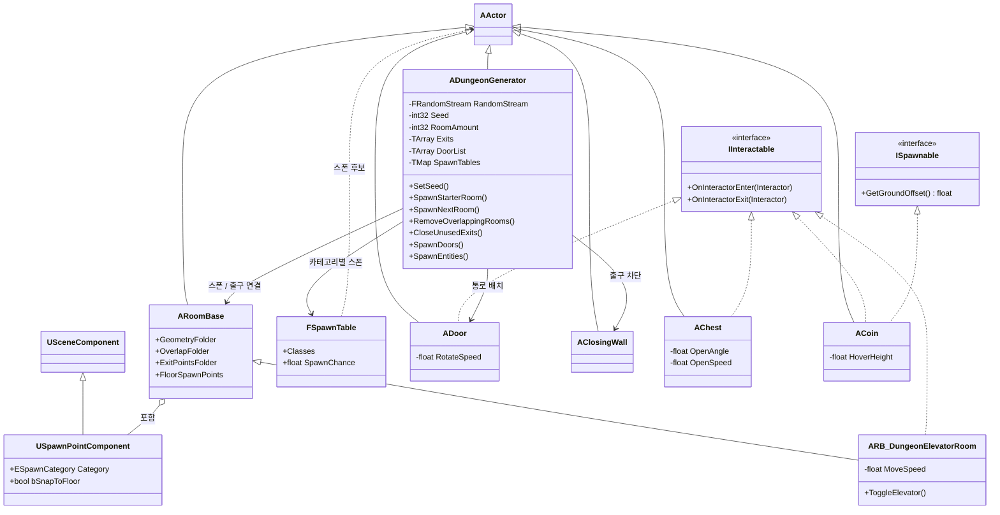

# AbyssGen

언리얼 엔진 5.7 기반 절차적 던전 생성(Procedural Dungeon Generation) 시스템. 시드 기반으로 모듈형 방(Room)을 출구 단위로 이어 붙여 던전을 생성하고, 겹침 검사·문/벽 배치·확률 기반 엔티티 스폰을 수행한다.

- **엔진**: Unreal Engine 5.7
- **언어**: C++ (런타임 모듈 `AbyssGen`) + 블루프린트
- **플러그인**: StateTree, GameplayStateTree, Modeling Tools Editor Mode
- **모듈 의존성**: Engine, AIModule, UMG
- **핵심 구현 위치**: `Source/AbyssGen/PDG`

## 생성 방식

생성기(`ADungeonGenerator`)는 미리 만든 방 블루프린트를 출구 위치에 스냅해 붙이는 방식으로 던전을 구성한다. 그리드/타일맵을 사용하지 않으며, 방의 배치는 각 방이 가진 출구 포인트의 월드 트랜스폼으로만 결정된다.

- 무작위 분기(방 선택, 출구 선택, 스폰 확률)는 모두 단일 `FRandomStream`을 통과한다. 동일 시드는 동일한 던전을 생성한다.
- `Seed`가 `-1`이면 `FMath::Rand()`로 시드를 생성하고 화면에 출력한다.
- `RoomAmount`로 목표 방 개수를 지정한다. 겹침으로 폐기된 방은 카운트를 복구해 목표 개수를 유지한다.
- `RoomAmount % 10 == 0`인 차례에는 일반 방 풀(`RoomsToBeSpawned`) 대신 특수방 풀(`SpecialRoomsToBeSpawned`)에서 선택한다.

## 실행 흐름

`ADungeonGenerator::BeginPlay`가 파이프라인을 순서대로 실행한다.

```
BeginPlay
  ├─ SetSeed()           시드 초기화. -1이면 FMath::Rand()
  ├─ SpawnStarterRoom()  StarterRoom 배치, 출구·스폰 포인트 수집
  ├─ SpawnNextRoom()     재귀: 출구 1개 선택 → 방 스폰 → 겹침 검사
  │                      통과 시 사용한 출구 제거·새 출구 추가, RoomAmount까지 반복
  │
  └─ 타이머 1.0초 후 (오버랩 상태 갱신 대기)
       ├─ CloseUnusedExits()  남은 출구를 ClosingWall로 차단
       ├─ SpawnDoors()        DoorList의 통로에 Door 배치
       └─ SpawnEntities()     스폰 포인트별 확률 스폰
```

### 방 스폰 (`SpawnNextRoom`)

1. `Exits`가 비어 있으면 중단한다.
2. 특수방 차례 여부에 따라 풀을 고르고, 풀이 비어 있으면 중단한다(빈 배열 인덱싱 방지).
3. `RandomStream.RandRange`로 방 클래스와 출구를 각각 선택한다.
4. 선택한 출구의 위치·회전에 방을 스폰하고, 그 출구를 `DoorList`에 추가한다.
5. `RemoveOverlappingRooms()`로 겹침을 검사한다.
6. 겹치지 않으면 사용한 출구를 `Exits`에서 제거하고 새 방의 출구를 `Exits`에 추가, 스폰 포인트를 수집한다.
7. `RoomAmount`를 감소시키고 0보다 크면 재귀 호출한다.

### 겹침 검사 (`RemoveOverlappingRooms`)

새 방의 `OverlapFolder` 하위 `UBoxComponent`마다 `GetOverlappingComponents`를 호출한다. 겹치는 컴포넌트의 소유자가 자기 방이 아니면 `bCanSpawn = false`, `RoomAmount++` 후 방을 `Destroy()`하고 종료한다. 폐기된 출구는 다음 재귀에서 다른 방/출구로 재시도된다.

### 엔티티 스폰 (`SpawnEntities`)

수집된 `USpawnPointComponent`마다:

1. 포인트의 `Category`로 `SpawnTables`에서 `FSpawnTable`을 찾는다(없거나 후보 클래스가 0이면 건너뜀).
2. `RandomStream.FRand() > SpawnChance`이면 해당 포인트는 비운다.
3. 후보 클래스 중 무작위 1개를 선택한다.
4. `bSnapToFloor`이면 포인트 +100 ~ -2000(Z) 구간을 `ECC_WorldStatic`으로 라인트레이스해 바닥에 스냅한다.
5. 스폰 클래스가 `ISpawnable`을 구현하면 `GetGroundOffset()`만큼 Z를 올린다.
6. 보정된 위치·회전으로 액터를 스폰한다.

> 출구 차단·문·엔티티 스폰은 방 배치 직후 물리 오버랩 상태가 갱신되기 전에 실행하면 안 되므로, `BeginPlay`에서 1.0초 타이머로 지연 실행한다.

## 방 구조

모든 방은 `ARoomBase`를 상속한다. 내부 컴포넌트는 역할별 `USceneComponent` 폴더로 분리되며, 생성기는 폴더의 자식 컴포넌트를 수집하는 방식으로만 방을 다룬다(방 내부 구성에 비의존).

| 컴포넌트 | 역할 |
| --- | --- |
| `GeometryFolder` | 보이는 지오메트리(벽·바닥) |
| `OverlapFolder` | 겹침 검사용 `UBoxComponent` |
| `ExitPointsFolder` | 출구 포인트(`GetChildrenComponents`로 수집) |
| `FloorSpawnPoints` | `USpawnPointComponent` 마커 |

`ARB_DungeonElevatorRoom`은 `ARoomBase`를 상속하고 `IInteractable`을 구현한다. 캐릭터 오버랩 시 `ToggleElevator()`로 엘리베이터를 상하 이동시킨다.

- 이동: `Tick`에서 `VInterpConstantTo`로 보간, 속도 `MoveSpeed = 600.0f` cm/s
- 상승 목표: 시작 위치 + Z 1900, 하강 목표: 시작 위치

## 스폰 데이터

```
USpawnPointComponent (방 BP에 배치)
  ├─ ESpawnCategory Category  : Enemy / Item / Prop
  └─ bool bSnapToFloor        : 바닥 라인트레이스 보정 여부

FSpawnTable (생성기에 카테고리별로 설정, TMap<ESpawnCategory, FSpawnTable>)
  ├─ TArray<TSubclassOf<AActor>> Classes  : 스폰 후보
  └─ float SpawnChance (0~1, 기본 0.5)    : 포인트당 스폰 확률
```

스폰 위치(방 BP의 마커)와 스폰 대상(생성기의 테이블)은 분리되어 있다.

## 상호작용 액터

`IInteractable`은 오버랩 진입/이탈 시 호출되는 두 함수(`OnInteractorEnter`, `OnInteractorExit`)를 정의한다. 구현 액터:

| 액터 | 동작 | 주요 파라미터 |
| --- | --- | --- |
| `ADoor` | `FacingArrow` 기준으로 캐릭터의 앞/뒤를 판정해 ±90° Yaw 회전. 이탈 시 원위치 | `RotateSpeed = 4.0` (RInterpTo) |
| `AChest` | `LidPivot`을 Roll 회전시켜 뚜껑 개방 | `OpenAngle = -100`, `OpenSpeed = 5.0` |
| `ACoin` | 회전·상하 부양 연출. 오버랩 시 `Destroy()`. `ISpawnable` 구현(바닥에서 띄움) | `RotationSpeed`, `BobSpeed`, `BobAmplitude`, `HoverHeight` |
| `ARB_DungeonElevatorRoom` | 오버랩 시 상하 이동 토글 | `MoveSpeed = 600`, 상승 Z +1900 |

`ISpawnable`은 `GetGroundOffset()` 한 함수로 스폰 시 바닥에서 띄울 높이를 반환한다. 생성기는 스폰 대상이 이 인터페이스를 구현했을 때만 오프셋을 적용한다.

## 구성 요소

| 클래스 | 역할 |
| --- | --- |
| `ADungeonGenerator` | 생성 파이프라인 전체. 방 배치·겹침 검사·문/벽/엔티티 스폰 |
| `ARoomBase` | 방 베이스. 역할별 폴더 구조 |
| `ARB_DungeonElevatorRoom` | 층 이동용 엘리베이터 룸 |
| `USpawnPointComponent` | 스폰 위치 마커 (카테고리·바닥 스냅) |
| `FSpawnTable` | 카테고리별 스폰 후보 + 확률 |
| `ADoor` | 통로 문 (앞/뒤 판정 개폐) |
| `AClosingWall` | 미사용 출구 차단 벽 |
| `AChest` · `ACoin` | 상호작용 오브젝트 |
| `IInteractable` | 오버랩 상호작용 인터페이스 |
| `ISpawnable` | 스폰 바닥 오프셋 인터페이스 |

## 클래스 다이어그램



> 저장소의 `Variant_*` 폴더는 언리얼 기본 템플릿에서 파생된 샘플이며, 본 시스템과 무관하다.
